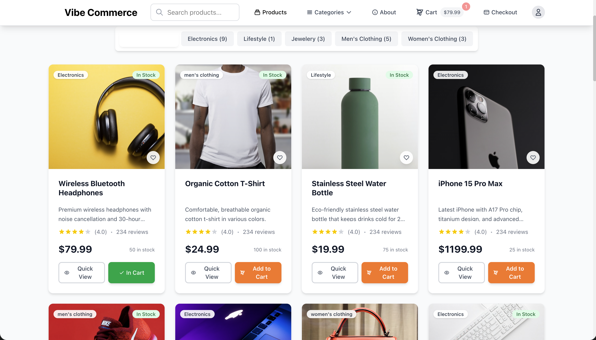
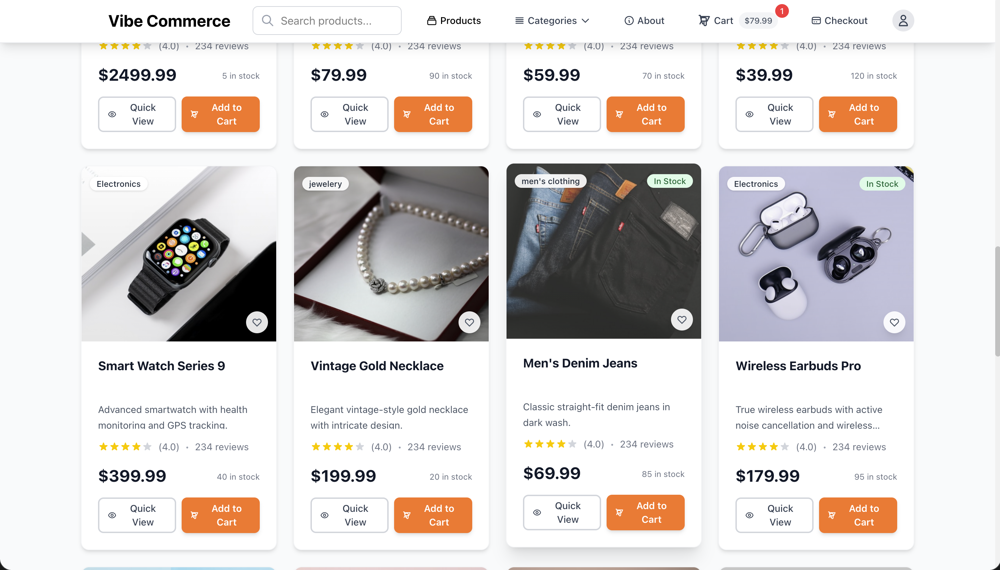
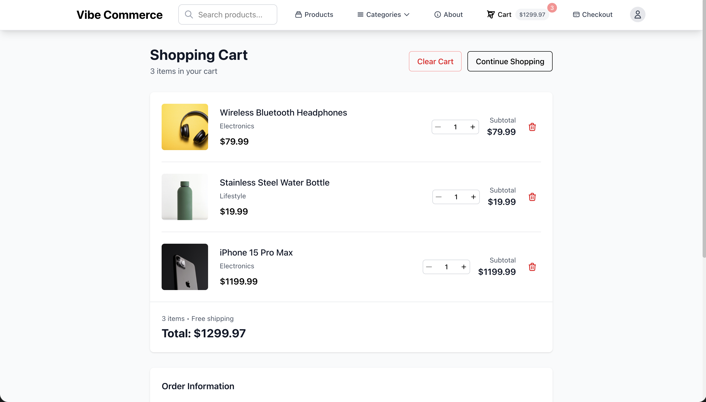
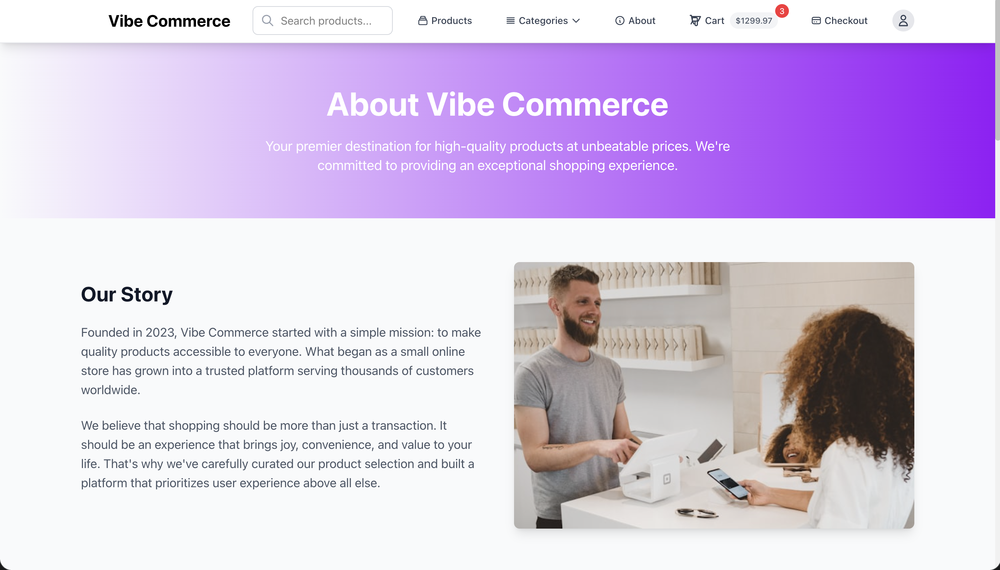

# 🛒 Vibe Commerce - Full-Stack E-Commerce Cart App

A modern, responsive full-stack e-commerce application built with React, Node.js, Express, and MongoDB. This project demonstrates a complete shopping cart implementation with product catalog, cart management, and mock checkout functionality.

## 🎥 Demo Video

> Click below to watch the full demo walkthrough of the **Vibe Commerce App** on YouTube 👇  

<p align="center">
  <a href="https://www.youtube.com/watch?v=M3DgnoE17D4" target="_blank">
    
  </a>
</p>


## 📸 Screenshots

### 🏠 Homepage


### 🛍️ Product Details


### 🛒 Cart


### 💳 Checkout


## 🌟 Features

### Frontend Features
- 📱 **Responsive Design** - Mobile-first approach with Tailwind CSS and glass morphism effects
- 🛍️ **Product Catalog** - Enhanced grid view with 21+ curated products including electronics, clothing, and jewelry
- 🏷️ **Category Navigation** - Amazon-like category browsing with dropdown navigation
- 🔍 **Advanced Filtering** - Filter by category, price range, and sort options
- 🛒 **Shopping Cart** - Add, remove, and update item quantities with enhanced UI
- 💳 **Mock Checkout** - Professional checkout flow with receipt generation
- 🎯 **Context State Management** - Optimized cart state using React Context with useCallback
- 🔄 **Real-time Updates** - Cart count, totals, and badges update in real-time
- 📊 **Loading States** - Smooth skeleton loading and spinner components
- 🚨 **Error Handling** - Graceful error handling with toast notifications
- 📱 **Progressive Enhancement** - Fallback to external API if backend unavailable
- ⭐ **Product Ratings** - Star ratings and stock indicators
- 💝 **Wishlist UI** - Heart buttons for favorite products
- 🎨 **Modern UI/UX** - Enhanced animations, hover effects, and user interactions

### Backend Features
- 🚀 **Enhanced RESTful API** - Well-structured API with category filtering and search
- 🗄️ **MongoDB Integration** - Mongoose ODM with enhanced connection stability
- 🌱 **Advanced Database Seeding** - 21 curated products with real images and categories
- 🔍 **Query Filtering** - Support for category, price range, and sorting filters
- 📂 **Category Management** - Dynamic category listing and filtering endpoints
- 🔒 **Error Middleware** - Comprehensive error handling and logging
- 📦 **CORS Support** - Cross-origin resource sharing configuration
- 🏗️ **MVC Architecture** - Organized code structure with enhanced controllers
- ⚡ **Performance** - Optimized database queries with connection pooling

## 🏗️ Project Structure

```
E-Commerce-App/
├── backend/
│   ├── src/
│   │   ├── controllers/
│   │   │   ├── productController.js
│   │   │   ├── cartController.js
│   │   │   └── checkoutController.js
│   │   ├── models/
│   │   │   ├── Product.js
│   │   │   ├── CartItem.js
│   │   │   └── Order.js
│   │   ├── routes/
│   │   │   ├── productRoutes.js
│   │   │   ├── cartRoutes.js
│   │   │   └── checkoutRoutes.js
│   │   └── db/
│   │       ├── connection.js
│   │       └── seed.js
│   ├── server.js
│   ├── package.json
│   └── .env
├── frontend/
│   ├── src/
│   │   ├── components/
│   │   │   ├── Navbar.jsx
│   │   │   ├── ProductCard.jsx
│   │   │   ├── CartItem.jsx
│   │   │   └── ReceiptModal.jsx
│   │   ├── pages/
│   │   │   ├── ProductsPage.jsx
│   │   │   ├── CartPage.jsx
│   │   │   └── CheckoutPage.jsx
│   │   ├── context/
│   │   │   └── CartContext.jsx
│   │   ├── services/
│   │   │   └── api.js
│   │   ├── App.jsx
│   │   ├── main.jsx
│   │   └── index.css
│   ├── package.json
│   ├── .env
│   ├── tailwind.config.js
│   └── postcss.config.js
└── README.md
```

## 🛠️ Tech Stack

### Frontend
- **React 18** - UI library with hooks and context
- **Vite** - Fast build tool and development server
- **React Router v6** - Client-side routing
- **Tailwind CSS** - Utility-first CSS framework
- **Axios** - HTTP client for API requests
- **React Toastify** - Toast notifications

### Backend
- **Node.js** - JavaScript runtime
- **Express.js** - Web application framework
- **MongoDB** - NoSQL database
- **Mongoose** - MongoDB object modeling
- **CORS** - Cross-origin resource sharing
- **dotenv** - Environment variables management

## 🚀 Quick Start

### Prerequisites
- Node.js (v14 or higher)
- MongoDB (local installation or MongoDB Atlas)
- npm or yarn package manager

### Installation

1. **Clone the repository**
   ```bash
   git clone <repository-url>
   cd E-Commerce-App
   ```

2. **Setup Backend**
   ```bash
   cd backend
   npm install
   ```

3. **Setup Frontend**
   ```bash
   cd ../frontend
   npm install
   ```

### Environment Variables

1. **Backend (.env)**
   ```env
   PORT=5000
   MONGO_URI=mongodb://localhost:27017/vibe_commerce
   NODE_ENV=development
   ```

2. **Frontend (.env)**
   ```env
   VITE_API_URL=http://localhost:5000/api
   ```

### Running the Application

1. **Start MongoDB**
   ```bash
   # If using local MongoDB
   mongod
   
   # Or start MongoDB service
   brew services start mongodb/brew/mongodb-community
   ```

2. **Start Backend Server**
   ```bash
   cd backend
   npm run dev
   ```
   The backend server will start on `http://localhost:5000`

3. **Start Frontend Development Server**
   ```bash
   cd frontend
   npm run dev
   ```
   The frontend will start on `http://localhost:5173`

## 📡 API Endpoints

### Products
- `GET /api/products` - Get all products
- `GET /api/products/:id` - Get single product

### Cart
- `GET /api/cart` - Get cart items and total
- `POST /api/cart` - Add item to cart
  ```json
  {
    "productId": "product_id_here",
    "qty": 1
  }
  ```
- `PUT /api/cart/:id` - Update cart item quantity
- `DELETE /api/cart/:id` - Remove item from cart
- `DELETE /api/cart` - Clear entire cart

### Checkout
- `POST /api/checkout` - Process checkout
  ```json
  {
    "name": "John Doe",
    "email": "john@example.com"
  }
  ```
- `GET /api/orders/:receiptId` - Get order by receipt ID

### Health Check
- `GET /api/health` - API health check
- `GET /` - API information

## 🎨 UI/UX Features

### Responsive Design
- Mobile-first approach
- Tablet and desktop optimizations
- Touch-friendly interfaces

### User Experience
- Loading states for all async operations
- Error handling with user-friendly messages
- Toast notifications for user actions
- Empty state handling for cart and products
- Confirmation dialogs for destructive actions

### Accessibility
- Semantic HTML structure
- ARIA labels and roles
- Keyboard navigation support
- Screen reader friendly

## 🧪 Testing

### Backend Testing (Optional)
```bash
cd backend
npm test
```

### Frontend Testing (Optional)
```bash
cd frontend
npm test
```

## 📦 Database Schema

### Product Model
```javascript
{
  name: String (required),
  price: Number (required),
  image: String (required),
  description: String (required),
  category: String (required),
  stock: Number (default: 0)
}
```

### CartItem Model
```javascript
{
  productId: ObjectId (ref: Product),
  qty: Number (default: 1),
  userId: String (default: 'guest')
}
```

### Order Model
```javascript
{
  cartItems: Array,
  total: Number,
  name: String,
  email: String,
  receiptId: String (unique),
  status: String (enum: ['pending', 'completed', 'cancelled'])
}
```

## 🔧 Development

### Available Scripts

#### Backend
- `npm start` - Start production server
- `npm run dev` - Start development server with nodemon
- `npm run seed` - Seed database with sample data

#### Frontend
- `npm run dev` - Start development server
- `npm run build` - Build for production
- `npm run preview` - Preview production build

### Code Organization

#### Backend
- **Controllers** - Handle business logic and HTTP responses
- **Models** - Database schemas and data validation
- **Routes** - API endpoint definitions
- **Middleware** - Error handling and request processing

#### Frontend
- **Components** - Reusable UI components
- **Pages** - Route-specific page components
- **Context** - Global state management
- **Services** - API communication layer

## 🌐 Deployment

### Backend Deployment
1. Set up MongoDB Atlas or similar cloud database
2. Update environment variables for production
3. Deploy to platforms like Heroku, Railway, or DigitalOcean

### Frontend Deployment
1. Build the production bundle: `npm run build`
2. Deploy to platforms like Netlify, Vercel, or AWS S3

### Environment Configuration
Update the frontend `.env` file with production API URL:
```env
VITE_API_URL=https://your-backend-domain.com/api
```

## 🔮 Future Enhancements

### Phase 2 Features
- [ ] User authentication and authorization
- [ ] Order history and tracking
- [ ] Product search and filtering
- [ ] Product categories and pagination
- [ ] Wishlist functionality
- [ ] Product reviews and ratings

### Phase 3 Features
- [ ] Payment gateway integration (Stripe/PayPal)
- [ ] Inventory management
- [ ] Admin dashboard
- [ ] Email notifications
- [ ] Multi-vendor support
- [ ] Advanced analytics

### Technical Improvements
- [ ] Unit and integration tests
- [ ] Docker containerization
- [ ] CI/CD pipeline
- [ ] Performance optimization
- [ ] SEO optimization
- [ ] PWA features

## 🤝 Contributing

1. Fork the repository
2. Create a feature branch (`git checkout -b feature/amazing-feature`)
3. Commit your changes (`git commit -m 'Add some amazing feature'`)
4. Push to the branch (`git push origin feature/amazing-feature`)
5. Open a Pull Request

## 📝 License

This project is licensed under the MIT License - see the [LICENSE](LICENSE) file for details.

## 🙏 Acknowledgments

- **Tailwind CSS** for the amazing utility-first CSS framework
- **Unsplash** for providing high-quality product images
- **FakeStore API** as fallback data source
- **React Community** for excellent documentation and resources

## 📞 Support

For support and questions:
- Create an issue on GitHub
- Contact the development team
- Check the documentation

---

Made with ❤️ by the Vibe Commerce Team# Ecommerce-cart-app
